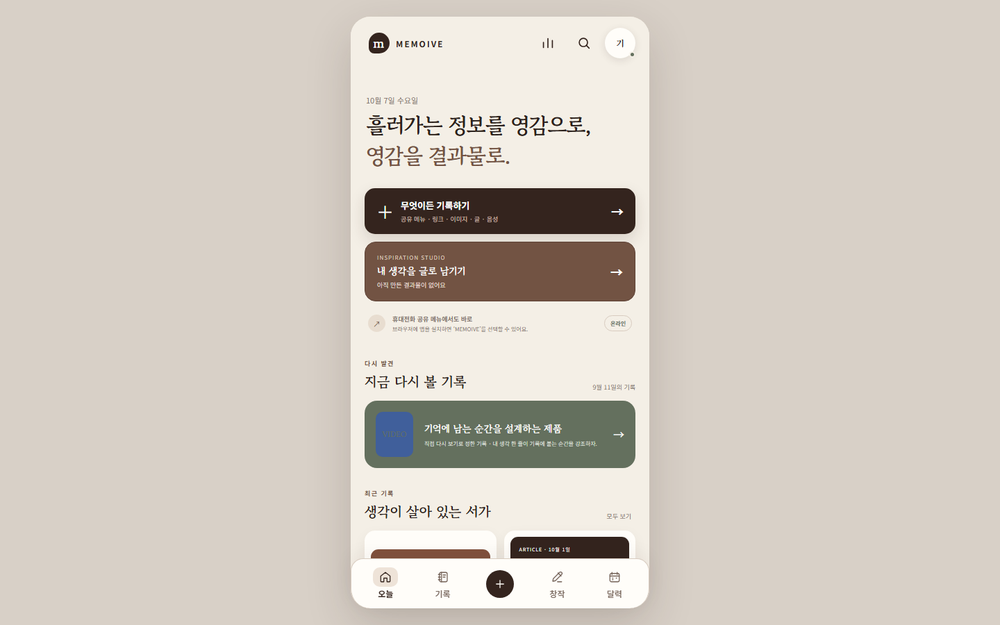

# MEMOIVE

저장한 자료에 내 생각을 남기고, 다시 찾아 글로 이어 쓰는 웹 서비스입니다.

[서비스 열기](https://memoive.vercel.app/) · [발표자료](docs/presentation/MEMOIVE-Presentation.pptx) · [제품 기획서](docs/PRD_MEMOIVE_2026-10-06-v01.md)

## 핵심 설계

**자료 기록 → 내 생각 → 다시 찾기 → 글쓰기**

- 원문, AI 해석과 내 생각을 구분해 보관합니다.
- 저장한 기록에서 출처가 연결된 초안을 만듭니다. AI 표현 제안은 선택 기능입니다.
- 공개 글과 영상 자막을 읽고, 자동 수집이 어려우면 본문을 직접 입력합니다.

저장 개수보다 내 생각이 실제 글로 이어지는지를 제품의 기준으로 정했습니다.

## 검증 범위

저장 실패, 검색, 백업 복원, 동시 수정과 출처 보존을 합성 자료와 브라우저 검사로 확인했습니다. 온라인 동기화는 한 사람의 기기를 연결하는 방식입니다.

외부 사용자의 글쓰기 시간과 만족도는 미측정입니다. 본문 수집과 AI 해석의 정확성에는 한계가 있습니다.

## 자료 안내

| 보고 싶은 내용 | 문서 |
|---|---|
| 기획과 판단 | [기획 근거](docs/planning-evidence-2026-10-06-v01.md) |
| 검사 결과와 다음 검증 | [검증 기록](docs/verification.md) / [사용자 검증 계획](docs/self-study-plan.md) |
| 시연과 구현 | [시연 순서와 기능별 한계](docs/README-DETAILS.md) / [저장 구조와 AI 사용 기준](docs/implementation-notes-2026-10-07.md) |

<details>
<summary>화면 미리보기</summary>



</details>

<details>
<summary>직접 실행하기와 자동 검사</summary>

Python이 설치된 환경에서 저장소 폴더의 터미널에 입력합니다.

```sh
python -m http.server 4182 --directory .
```

브라우저에서 http://127.0.0.1:4182/ 를 엽니다. 화면은 인증값 없이 열리지만, 운영 AI 서버의 허용 주소 설정에 따라 로컬 AI 요청은 거절될 수 있습니다.

**자동 검사 실행 — Node.js 24 이상**

```sh
npm ci
npx playwright install chromium
npm test
```

합성 자료 검사와 브라우저 검사 두 개를 모두 실행합니다. 브라우저 검사는 임시 로컬 서버를 사용하고 외부 요청을 차단합니다. 개별 명령과 저장 정책은 [실행 및 검증 상세](docs/README-DETAILS.md)에 있습니다.

</details>

제작자가 문제와 기록 흐름을 정하고, Codex가 코드 작성과 검사를 보조했습니다. 개인 기록과 외부 서비스 인증값은 공개 저장소에 포함하지 않습니다.
